<div id="header" align="center">
  
</div>
<div id="badges"align="center">
 


</div>
<div id="header1" align="center">
	
<!--[](https://user-badge.committers.top/egypt/EmanGhazy2002) -->
  
</div>
<div id="view" align="center">
	
[](https://git.io/typing-svg)
<!--<h1>
  Hi.
</h1>-->
</div>  

<div align="center">
  
</div>

---
### 👩‍💻: About Me :
```node
#SPDX-License-Identifier: MIT
pragma npm ^3.10.1
class Profile {
    constructor() {
        this.name = "Eman Ghazy";
        this.jobTitle = "Back-End Developer";
        this.country = "Egypt";
        this.currentlyWorking = ["Nodejs", "Mongodb", "Restful Api"];
        this.currentlyLearning = ["Advanced Nodejs", "Mongodb with Mongoose"];
    }

    getSkills() {
        let skills = ["Nodejs", "PHP", "Laravel", "Js", "C/C++", "HTML & CSS"];
        return skills;
    }
}

const myProfile = new Profile();
console.log("Name:", myProfile.name);
console.log("Job Title:", myProfile.jobTitle);
console.log("Country:", myProfile.country);
console.log("Currently Working:", myProfile.currentlyWorking);
console.log("Currently Learning:", myProfile.currentlyLearning);
console.log("Skills:", myProfile.getSkills());
```
---

### :hammer_and_wrench: Languages and Tools :
<div align="center">
 
 
  
  
  
  
  
  
  
  
  
  
  
  
  
  
  
</div>

---

### :fire: My Stats :
<div align="center">
  
[](https://github.com/EmanGhazy2002?tab=repositories)

[](https://github.com/anuraghazra/github-readme-stats)

---

<table><tr><td valign="top" width="50%">

<br>


</td><td valign="top" width="50%">



</td></tr></table>

<table><tr><td valign="top" width="50%">


</td><td valign="top" width="50%">


</td></tr></table>

</details>

---


---


---

 [](https://github.com/ryo-ma/github-profile-trophy)
</div>

---

### :writing_hand: Blog  : [EmanGhazy2002](https://EmanGhazy2002.github.io/Blog/)


